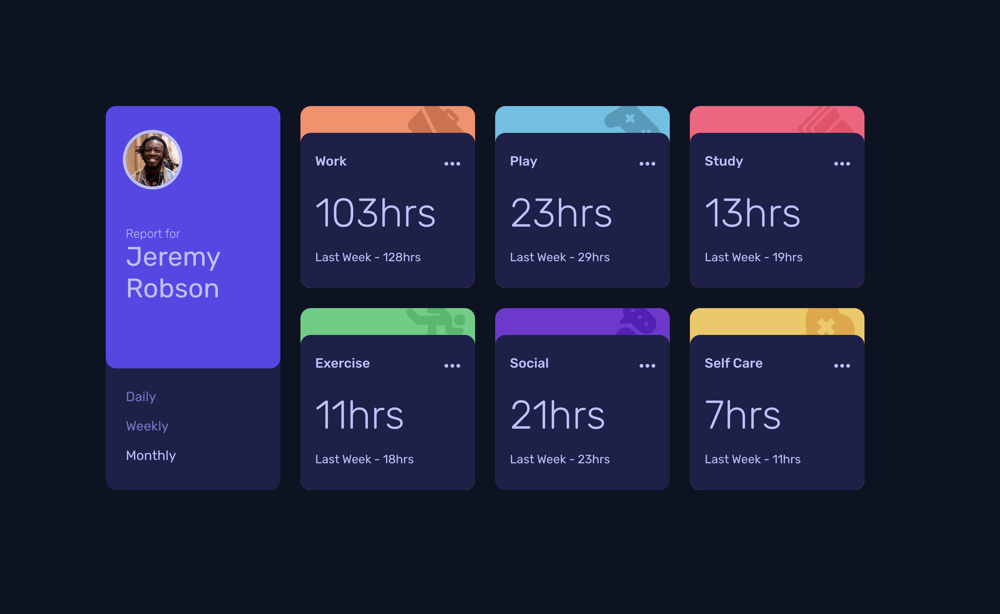
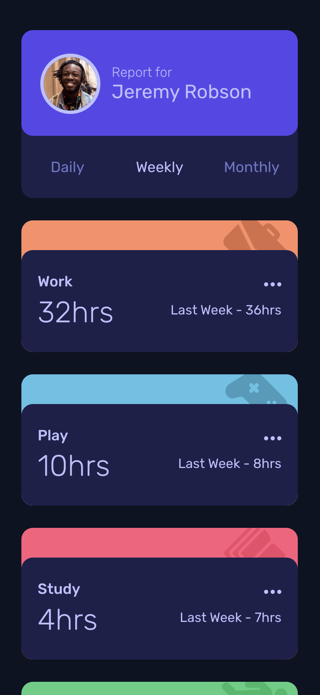

# Frontend Mentor - Multi-step form solution

This is a solution to the [Multi-step form challenge on Frontend Mentor](https://www.frontendmentor.io/challenges/multistep-form-YVAnSdqQBJ). Frontend Mentor challenges help you improve your coding skills by building realistic projects.

## Table of contents

- [Overview](#overview)
  - [The challenge](#the-challenge)
  - [Screenshot](#screenshot)
  - [Links](#links)
- [My process](#my-process)
  - [Built with](#built-with)
  - [What I implemented](#what-i-implemented)

## Overview

### The challenge

Users should be able to:

- [x] Complete each step of the sequence
- [x] See a summary of their selections on the final step and confirm their order
- [x] View the optimal layout for the interface depending on their device's screen size
- [x] See hover and focus states for all interactive elements on the page

### Screenshot

|                            Desktop                            |
| :-----------------------------------------------------------: |
|                                          |
|                          **Mobile**                           |
|  |

### Links

- Solution URL: [Github](https://github.com/RylanZhou/frontend-mentor-multi-step-form)
- Live Site URL: [Vercel](https://frontend-mentor-multi-step-form-nu.vercel.app/)

## My process

### Built with

- Semantic HTML5 markup
- Scss
- Flexbox
- Mobile-first workflow
- [React](https://reactjs.org/) - JS library
- React Context Hook
- TypeScript

### What I implemented

1. Use the recently released css unit `dvw` and `dvh` to set the width and height to automatically make the element fit in any viewport size.

2. Use `createContext` and `useContext()` hook to store and access state in different forms and to control current step.

3. For customized checkbox/switch, use a hidden `<input>` element to control the value, then create the visual checkbox/switch by styling a `` or a `<label>` element.

4. It is a good idea to use `React.lazy` to render different forms until they are needed. Together with `lazy`, should use `<Suspend fallback={MyComponent}>` to handle when the actual component is being loaded.
